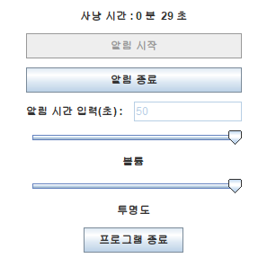

# 회수 타이머 v1.0 / 24.10.9 - 24.10.10

## 주요 기능

- **타이머 설정:**  
  원하는 시간(50초 이상 130초 이내)을 입력 후 타이머를 시작

- **사운드 알림:**  
  입력한 시간 간격에 따라 사운드 파일 재생

- **볼륨 조절**  
  *(단, 사운드 파일 재생 중에는 볼륨 조절이 불가능합니다.)*

- **투명도 조절**  

- **Always On Top**  

## 사용 기술

- **Java** 
- **Swing** 
- **Java Sound API** 

## 요구 사항

- **이 애플리케이션을 사용하기 위해서는 Java가 설치되어 있어야 합니다.** [다운로드하기](https://www.java.com/ko/download/)

## 다운로드

- [Google Drive 링크](https://drive.google.com/file/d/15zEDLBG8D_tHJG2LqJjlcpw4953MR03g/view?usp=sharing)
